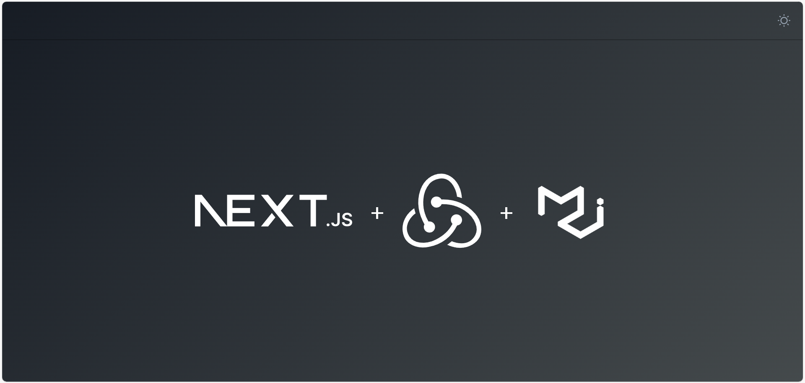

# nextv14-mui-mini-kit

A template for kickstarting Next.js 14(App Router) projects with Material-UI (MUI) as the CSS framework, Redux Toolkit for global state management, and TypeScript for type safety.

## Getting Started

### Prerequisites

Before you begin, make sure you have Node.js ( >=18.x) and npm installed on your machine.

### Installation

Create a new Next.js project using this template with the following command:

```bash
npx nextv14-mui-mini-kit <project-name>
```

Replace ```<project-name>``` with the desired name for your project.

### Usage
Once the installation is complete, navigate to the project directory:

```bash
cd <project-name>
```

Start the development server:
```bash
npm run dev
```

Visit http://localhost:3000 in your browser to see your app in action.

Page Should look  like this:
- Dark mode(default): 
- Light mode: 

### Features
- Next.js 14: Utilizing the latest version of Next.js for a performant and efficient development experience.
- Material-UI (MUI): A popular React UI framework for building responsive and aesthetically pleasing user interfaces.
- Redux Toolkit: State management made easy with Redux Toolkit, providing a predictable and efficient way to manage global state.
- TypeScript: Enhance your development process with TypeScript for static typing and improved code quality

### Folder Structure
```plaintext
|-- /src
|   |-- /app          # Next.js pages
|   |-- /client     # React components
|      |-- /components # General component
|         |-- /sections    # specific page components
|         |-- /shared      # common components  
|      |-- /redux-state          # Redux setup and slices
|      |-- /theme         # customized mui theme files
|-- /public             # Public assets
```

### Customization
Feel free to customize the template according to your project requirements. Modify the components, Redux slices, and theme styles as needed.

### Additional Documentation
For more detailed information on the Next.js, MUI, and Redux Toolkit, refer to their official documentation:

-  [Next.js Documentation](https://nextjs.org/docs)
- [Material-UI Documentation](https://mui.com/)
- [Redux Toolkit Documentation](https://redux-toolkit.js.org/)

### Acknowledgments
Special thanks to the Next.js, MUI, and Redux Toolkit communities for their fantastic tools and resources.